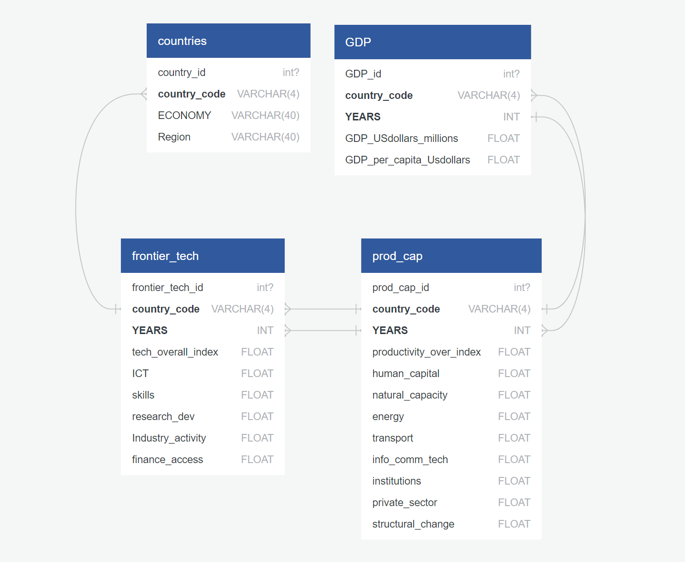
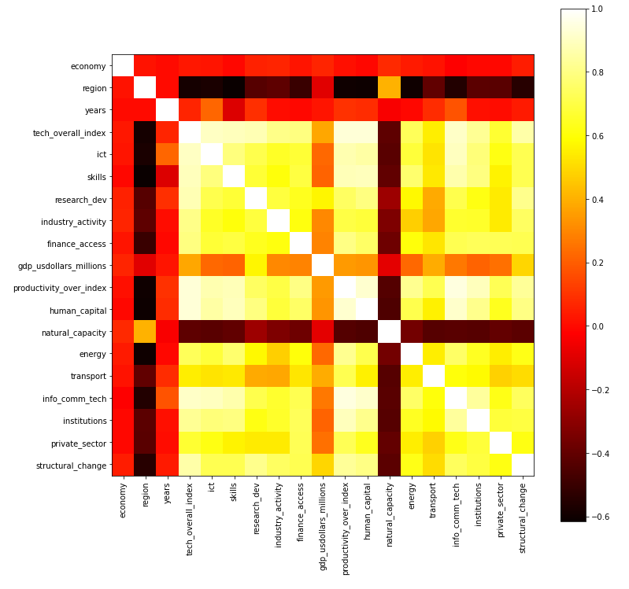
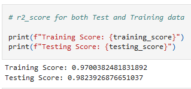
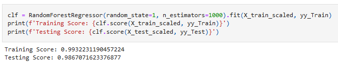
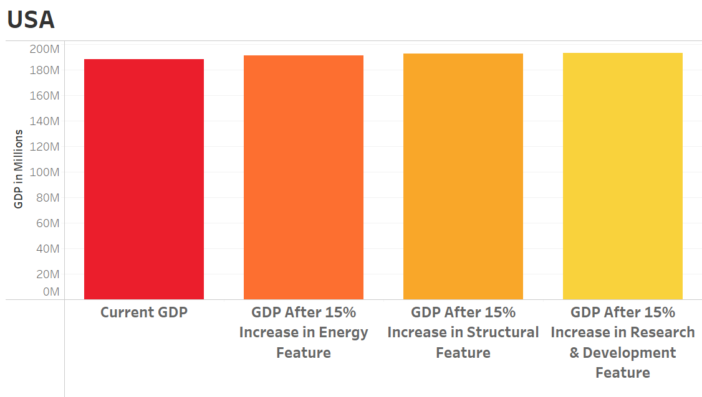
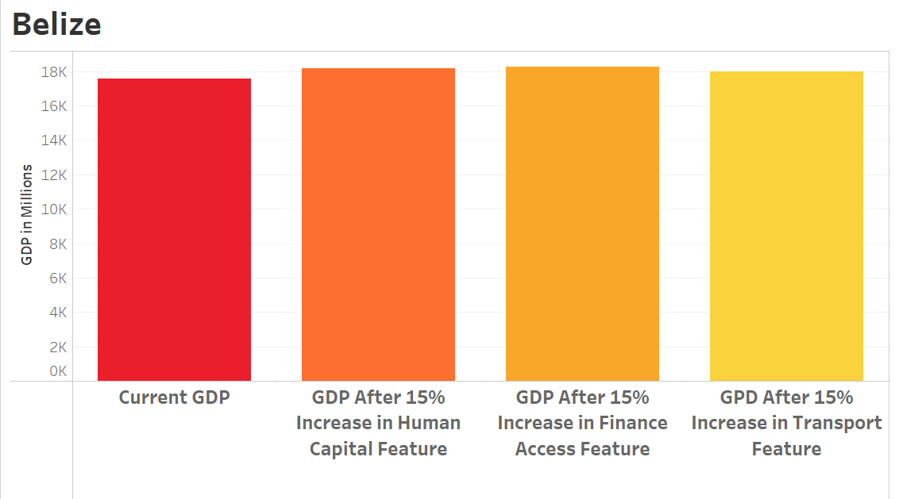
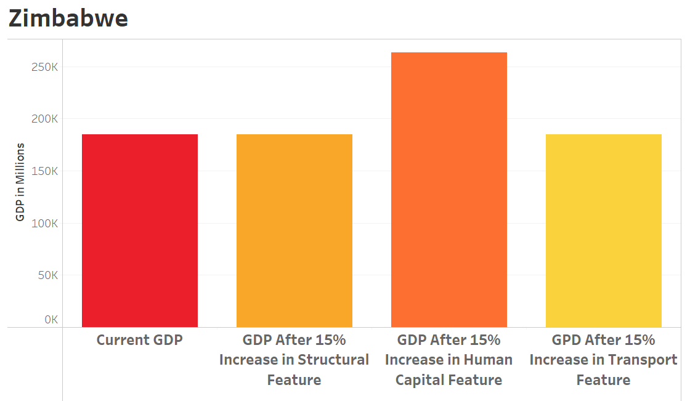

# The Impacts of Productive and Technological Capacities on GDP

## Selected Topic

Our project analyzes the relationship between ***GDP*** and the productive and technological capacities of different countries between the years **2008** and **2019**.

## Selection Reasoning

It is important to understand how the productive and technological capacities of countries affects their ***GDP*** so that a government can invest in the most important capacities to increase economic growth. Moreover, assessing the relationship between productive and technological capacities and ***GDP*** will help diminish economic inequality between different regional economies in the world.

## Description of Data Sources

The data sources used for this project are derived from two reputable international organizations:
**The United Nations Conference on Trade and Development (UNCTAD)** and the **World Bank**.

- From **UNCTAD**, the data selected include the productive capacities index [(PCI)](/Data/Clean_Data/Productive_capacities_index,annual.csv) and the frontier technology readiness index [(FTRI)](/Data/Clean_Data/Frontier_technology_readiness_index,annual.csv).

- The ***PCI*** measure the levels of productive capacities along three pillars for a given economy: productive resources, entrepreneurial capabilities and production linkage. The features of the ***PCI*** analyzed for each country in this project include: human capital, natural capital, energy, transport, ICT, institutions, private sector, and structural change.

- The ***FTRI*** measures technological capacities related to physical investment, human capital and technological effort, and covers national capacities to use, adopt and adapt these technologies. The features of the ***FTRI*** analyzed for each given country in this project include: ICT, Skills, Research and Development, Industry Activity, and Access to Finance.

- From the **[World Bank](https://data.worldbank.org/indicator/NY.GDP.PCAP.CD?end=2021&name_desc=true&start=2021)**, the data selected include countries broken by global regions and six income levels. Each country has a measurement for and ***GDP***:  
    - ***GDP*** is the sum of gross value added by all resident producers in the economy plus any product taxes and minus any subsidies not included in the value of the products.

## Questions Addressed

- The main question we will address is what are the most important productive capacity and technological capacity features that a government should invest in to increase their ***GDP***. 
- Another question we address is how do productive capacity and technological capacity features differ between countries in different regions of the world.

## Descriptions of Machine Learning Model Methodology

Using **Multivariate Linear Regression** and **Random Forest Classifiers** to analyze relationships in ***GDP*** factors.

### Description of Preliminary Data Preprocessing:

  * Our preliminary data preprocessing began with viewing how we could connect our four data tables. Our first data table, World development indicators ***(WDI)***, provided us with a country code ***(CC)*** field that we could use to identify the rest of our data tables going forward. Using Excel’s INDEX MATCH function, I was able to append the ***(CC)*** field onto our PCI and FTRI tables. Our tables had to be converted into CSV files from XLS format. 

  
   Data Table Schema  

  Finally, before importing into Jupyter we had to convert our files into UTF-8-character encoding using a simple work around in Notepad. Our data tables were relatively clean as they have been prepared by two reputable international organizations that focus on world economic data collection, and thus we were able to simply drop nulls using pandas.

### Description of Preliminary Feature Engineering and Preliminary Feature Selection, Including Decision-Making Process:

  * For our preliminary feature engineering we chose to use a correlation matrix heatmap to help visualize the relationship between our numerical values. 

  
   Correlation Matrix Heatmap  

  * We did find that two fields that are overall composites of our ***PCI*** and ***FTRI*** fields were heavily correlated with all our other fields. We dropped our ***(CC)*** field for our analysis as it is simply a duplicate identifier for our *"economy"* field.
 

### Description of How Data was Split Into Training and Testing Sets:

  * For our **multivariate linear regression model**, it was important to split our data into training and testing sets as it is necessary for supervised machine learning. It will first use the training set to learn, and then use the testing set to assess its performance. For our purposes we split our data into *X* and *y* in order to be able to predict our target of ***GDP in millions***. These *X* and *y* values were then split again into training and testing sets. By splitting our data this way, we will be able to ensure that our model has a way to evaluate the predictions it calculates.

### Explanation of Model Choice, Including Limitations and Benefits:

  * For our first model we chose a **multivariate linear regression**, as this model will help form the basis for a predictive analysis tool. The final model will help countries determine how investments or losses in certain features will impact their ***GDP*** growth. Our next model will be a **random forest classifier**, as it can identify which features have the greatest impact on our target in. In our case the target is ***GDP***, and thus our model help give countries an idea of what economic features to invest in and safeguard the most. Some limitations of our models is that they will not be able to take in all our features. Machine learning requires zero null values which meant that some countries with incomplete economic data will not be able to be part of our model.

### Description of how the model has been trained thus far:

  * **Mulitvariate Linear Regression** was utilized on all fifteen features for *X* and *gdp_usdollars_millions* for *y* to find the Actual Value vs Difference in Actual and Predicted Values. This was how the model was first trained. The second way the model was trained was by utilizing the **Random Forest Classifiers** method. This was done to gain more information from the data and increase the training/testing scores.

### Machine Learning Model Scores:

  * The **mulitvariate linear regression** model produced a training score of: ~0.97, and a testing score of: ~0.98.

  
   MLR Testing and Training Scores  

  * The **Random Forest Classifier** model produced a training score of: ~0.99, and a testing score of: ~0.99.

  
   RFC Testing and Training Scores  

### Final Visualizations

  * To complete our analysis we circled back to our original questions we wanted to answer.
  **"What are the most important productive capacity and technological capacity features that a government should invest in to maximize their GDP?"**, and, 
  **"How do productive capacity and technological capacity features differ between regions of the world?"**
  We utilized Tableau to get the model data into visualizations that would provide answers to our questions.

#### 15% Increase to capacity features to see GDP gain:

  * For the first three graphs, the first question was answered in a slight form. Since we only utilized a smaller pool of features and an even smaller pool of countries the real question of "what are the most important feature that a country should invest into" wasn't fully answered. Instead it provided proof, especially in the Zimbabwe graph, that utilizing the whole dataset would uncover true answers to the original question and this specific analysis was a step in the correct direction.

  
   Graph of USA 15% Percentage Increase Predictions 

  * The visualization for the USA exemplifies how only cherry picking the features really only precludes an in depth answer and more or less states an possible obvious point. If you invest in any of these capacities in the USA, it will in some form or another increase the GDP, but none of these features stood out as "important".

  
   Graph of Belize 15% Percentage Increase Predictions 

  * Belize tells a similar story but starts to provide deeper insight into how these features shouldn't be chosen arbitrarily. We chose Productive feature capacities for Belize due to it already having a slant in this direction over the Technological feature capacities, but the results were inconclusive. Utilizing all of the features would have shown us what is most important for a country instead of making an educated guess.
   

  * For the third graph, we again picked just three Productive Capacity features that we felt would show an increase. We struck gold on this one, as is shown, there is a massive increase in GPD if Zimbabwe was to even just invest 15% of it's combined resources into Human Capital.

  
   Graph of Zimbabwe 15% Percentage Increase Predictions 

  * This last graph was truly what we had been aiming for with the first question. It also showed that with a bit more work put in to utilize the full dataset we could have some real world answers on our hands. Or at least the beginnings of one.

#### Second Answer:

  * What follows is the final interactive map that provides answers to our second question. This of course casts an incredibly large net with only countries removed from the dataset due to these countries having large amounts of data missing. This is due to a variety of reasons usally in the form of civil unrest, military actions or anything else that completely disrupted the countries economy to the point that no data could be gathered.

  *When hovered over each country shows it's GDP in millions, its Productivity and Technological Capacities.* 
  *The Capacities are summed up into Indexes with the Productivity on a scale of 0-100 and the Technological on a scale of 0-1.*

<!--# Test embed code utilizing Tableau's Embedding API v3 library

<tableau-viz id="tableauViz"
  src='https://public.tableau.com/app/profile/joseph.larose/viz/CountriesGDPRelationship/CNTRY-GDP'
  device="desktop" toolbar="bottom" hide-tabs hide-edit-button>
</tableau-viz>
->
<!-- # Embed code from Tableau Public to have 'Countries GDP Relationship' as in interactive element -->
  

  <noscript>
  
  </noscript>

  <object class='tableauViz' style='display:none;'>
  <param name='host_url' value='https%3A%2F%2Fpublic.tableau.com%2F' />
  <param name='embed_code_version' value='3' />
  <param name='site_root' value='' />
  <param name='name' value='CountriesGDPRelationship&#47;CNTRY-GDP' />
  <param name='tabs' value='no' />
  <param name='toolbar' value='yes' />
  <param name='static_image' value='https:&#47;&#47;public.tableau.com&#47;static&#47;images&#47;Co&#47;CountriesGDPRelationship&#47;CNTRY-GDP&#47;1.png' />
  <param name='animate_transition' value='yes' />
  <param name='display_static_image' value='yes' />
  <param name='display_spinner' value='yes' />
  <param name='display_overlay' value='yes' />
  <param name='display_count' value='yes' />
  <param name='language' value='en-US' />
  </object>

  

  

 

### Conclusion

  * While an important factor, the larger picture shows just that. There is a lot of data and a lot to parse. While fun to peruse, a more concise model that had the data stored as SQL to increase response time or even better pick specific nations that exemplifies that regions Capacities and having just these as interactive examples with more detail. An even further consideration building off that last idea is where all of the available data is there and you can select any country to bring it to the foreground with more detail. This combined with other toggles and views such as comparing two countries, or selecting regions and comparing those with the ability to add or take away Productive and Technological features or capacities as a whole.

***

  * In conclusion, there is a lot of excellent data available with a robust machine learning model with a high prediction rate, but the analysis merely gleaned the very top of this iceberg. Further analysis would be necessary to really uncover what could honestly be very important finds.

## Links to Presentation Slides, Dashboard, Collaborator and Presentation text files:

 - [Presentation Slides](https://docs.google.com/presentation/d/1Jcp-525SAy1fqANWJpyrW5gBkoJuHJ20XVnxLsWbyDU/edit?usp=sharing).

 - [Interactive: USA Percentage Increase Predictions](https://public.tableau.com/app/profile/joseph.larose/viz/USAGPDIncreasePredictions/USA).

 - [Interactive: Belize's Percentage Increase Predictions](https://public.tableau.com/app/profile/joseph.larose/viz/BelizeGPDIncreasePredictions/Belize).

 - [Interactive: Zimbabwe's Percentage Increase Predictions](https://public.tableau.com/app/profile/joseph.larose/viz/ZimbabweGDPIncreasePredictions/Zimbabwe).

  - [Link to Interactive](https://public.tableau.com/app/profile/joseph.larose/viz/CountriesGDPRelationship/CNTRY-GDP) of country and region map showcasing GDP, Productive capacitites and Technological capacities.

 - [Link](https://docs.google.com/document/d/1mGWqPEkqyLVoLMZf_UMSj-bgQHhv7QTlxqMlQqd-GJQ/edit) to Presentation Notes.

 - [File of Collaborators](Resources/Collaborators.txt) and what they have worked on. File kept separate to ease in editing.
